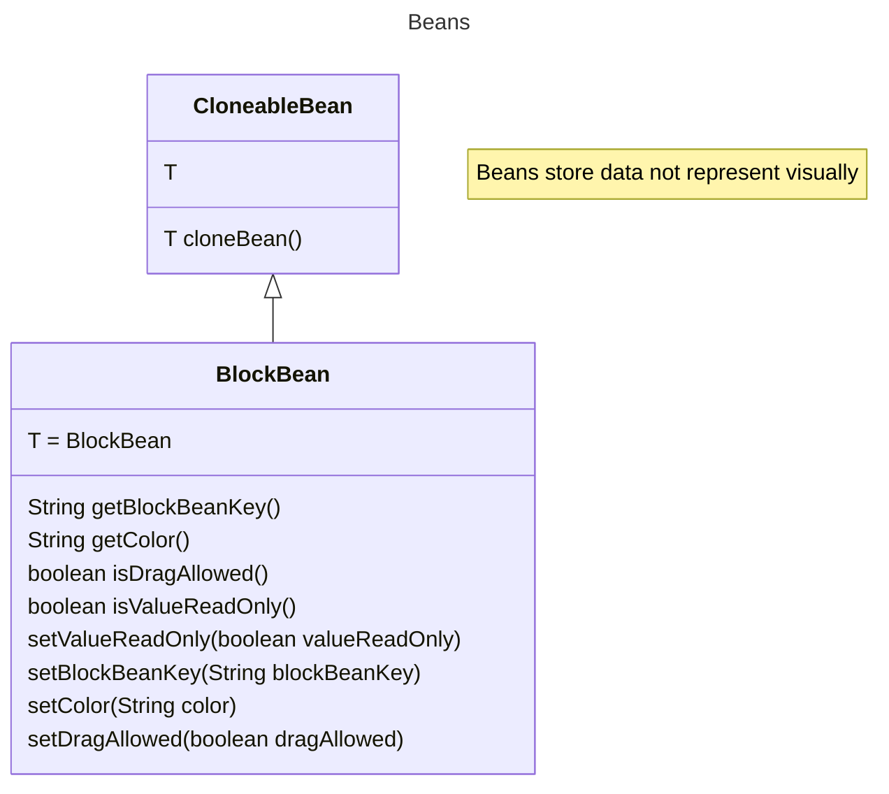

```mermaid
---
title: Beans
---
classDiagram
    note "Beans store data not represent visually"
    CloneableBean <|-- BlockBean
    class CloneableBean {
        T
        T cloneBean()
    }
    class BlockBean {
        T = BlockBean
        String getBlockBeanKey()
        String getColor()
        boolean isDragAllowed()
        boolean isValueReadOnly()
        setValueReadOnly(boolean valueReadOnly)
        setBlockBeanKey(String blockBeanKey)
        setColor(String color)
        setDragAllowed(boolean dragAllowed)
    }
```