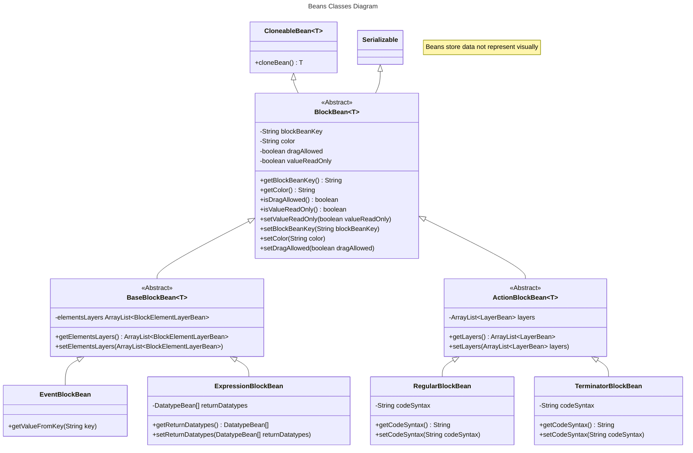

```mermaid
---
title: Beans Classes Diagram
---
classDiagram
    note "Beans store data not represent visually"
    class CloneableBean~T~ {
        +cloneBean() T
    }

    class BlockBean~T~ {
        <<Abstract>>

        -String blockBeanKey
	    -String color
	    -boolean dragAllowed
	    -boolean valueReadOnly

        +getBlockBeanKey() String
        +getColor() String
        +isDragAllowed() boolean
        +isValueReadOnly() boolean
        +setValueReadOnly(boolean valueReadOnly)
        +setBlockBeanKey(String blockBeanKey)
        +setColor(String color)
        +setDragAllowed(boolean dragAllowed)
    }
    CloneableBean~T~ <|-- BlockBean~T~
    Serializable <|-- BlockBean~T~

    class BaseBlockBean~T~ {
        <<Abstract>>

        -elementsLayers ArrayList~BlockElementLayerBean~

        +getElementsLayers() ArrayList~BlockElementLayerBean~
        +setElementsLayers(ArrayList~BlockElementLayerBean~)
    }
    BlockBean~T~ <|-- BaseBlockBean~T~

    class EventBlockBean {
        +getValueFromKey(String key)
    }
    BaseBlockBean~T~ <|-- EventBlockBean

    class ExpressionBlockBean {
        -DatatypeBean[] returnDatatypes

        +getReturnDatatypes() DatatypeBean[]
        +setReturnDatatypes(DatatypeBean[] returnDatatypes)
    }
    BaseBlockBean~T~ <|-- ExpressionBlockBean

    class ActionBlockBean~T~ {
        <<Abstract>>

        -ArrayList~LayerBean~ layers

        +getLayers() ArrayList~LayerBean~
        +setLayers(ArrayList~LayerBean~ layers)
    }
    BlockBean~T~ <|-- ActionBlockBean~T~

    class RegularBlockBean {
        -String codeSyntax

        +getCodeSyntax() String
        +setCodeSyntax(String codeSyntax)
    }

    ActionBlockBean~RegularBlockBean~ <|-- RegularBlockBean
    class TerminatorBlockBean {
        -String codeSyntax

        +getCodeSyntax() String
        +setCodeSyntax(String codeSyntax)
    }
    ActionBlockBean~TerminatorBlockBean~ <|-- TerminatorBlockBean
```