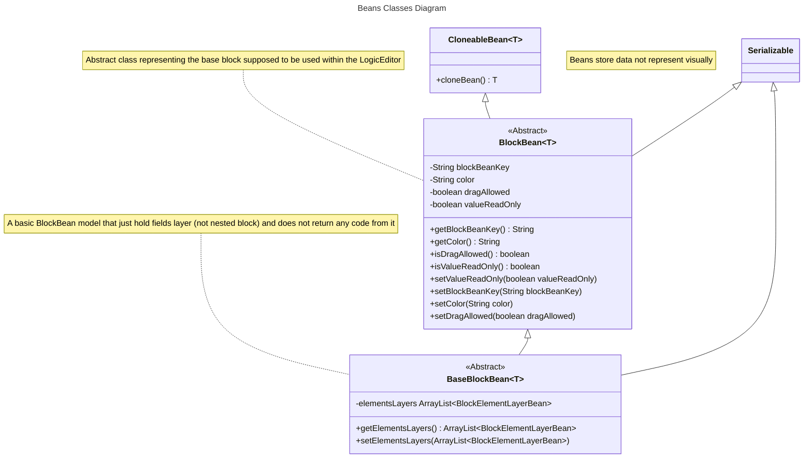

```mermaid
---
title: Beans Classes Diagram
---
classDiagram
    note "Beans store data not represent visually"
    class CloneableBean~T~ {
        +cloneBean() T
    }
    class BlockBean~T~ {
        <<Abstract>>

        -String blockBeanKey
	    -String color
	    -boolean dragAllowed
	    -boolean valueReadOnly

        +getBlockBeanKey() String
        +getColor() String
        +isDragAllowed() boolean
        +isValueReadOnly() boolean
        +setValueReadOnly(boolean valueReadOnly)
        +setBlockBeanKey(String blockBeanKey)
        +setColor(String color)
        +setDragAllowed(boolean dragAllowed)
    }
    note for BlockBean "Abstract class representing the base block supposed to be used within the LogicEditor"
    CloneableBean~T~ <|-- BlockBean~T~
    Serializable <|-- BlockBean~T~

    class BaseBlockBean~T~ {
        <<Abstract>>

        -elementsLayers ArrayList~BlockElementLayerBean~
        
        +getElementsLayers() ArrayList~BlockElementLayerBean~
        +setElementsLayers(ArrayList~BlockElementLayerBean~)
    }
    note for BaseBlockBean "A basic BlockBean model that just hold fields layer (not nested block) and does not return any code from it"
    BlockBean~T~ <|-- BaseBlockBean~T~
    Serializable <|-- BaseBlockBean~T~
```